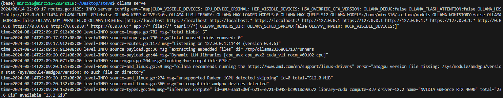
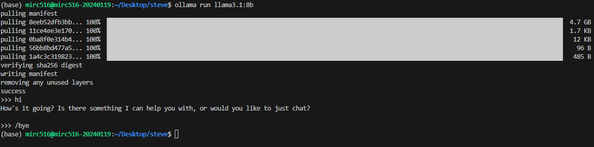

# auto_read_paper
使用llama3.1自己讀paper和分類
---
## 事前準備
- python套件安裝
```
pip install ollama
pip install PyPDF2
```
- 安裝 [ollama](https://ollama.com/)
- 在 Terminal 執行以下指令，確保 ollama 正在執行
```bash
ollama serve
```
Terminal 會出現類似下面的內容

- 第一次執行的時候先**打開新的 Terminal** ，在上面輸入以下內容，程式將會自動下載 [llama3.1:8b](https://ollama.com/library/llama3.1) 模型並開啟聊天機器人
```bash
ollama run llama3.1:8b
```
- 成功之後會像下面這樣，可以試著跟他聊天看看

- 最後在對話的地方輸入```/bye```關閉 llama3.1:8b

## 程式執行
- 修改以下部分
```python
folder_path = "pdf_folder_path"
search_topic = "topic_to_search"
csv_path = "output_file.csv"
```
- **打開新的 Terminal** 並輸入以下指令執行程式 
```bash
python auto_find_relevance_pdf.py
```
- 執行完後輸出的 csv 內容如下

|  Filename   | Title      | Relevance | Reason    |
| ----------- | ------------ | ----------- | ----------- |
| file1.pdf   | title of file1 | 是 | 選擇是或否的原因   |
| file2.pdf   | title of file2 | 否 | 選擇是或否的原因   |
| file3.pdf   | title of file3 | 是 | 選擇是或否的原因   |
| ...  | ... | ... | ...   |
 
*補充: title、Relevance、Reason有時會因為llama的輸出導致內容是空的，但不影響整體的讀寫，目前正在想辦法解決此問題*